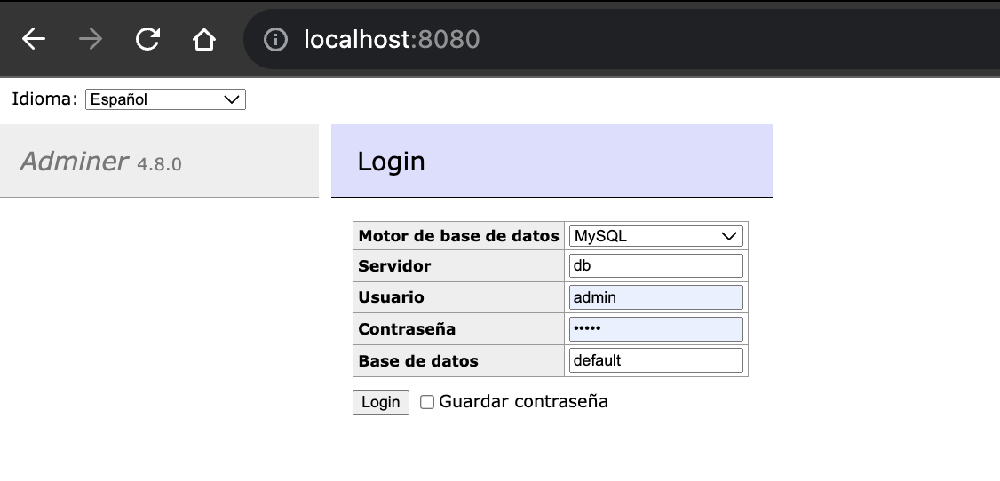
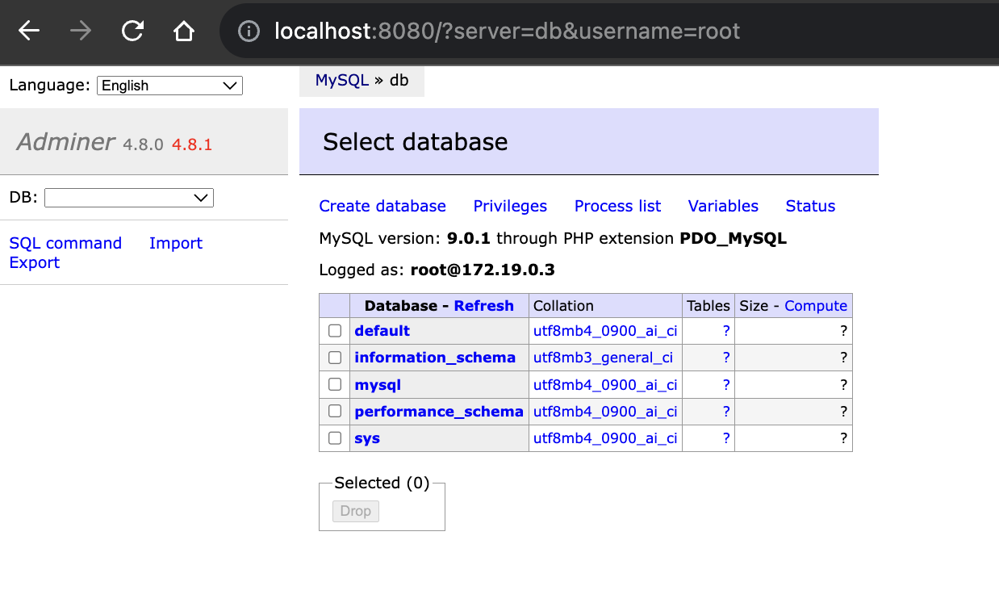
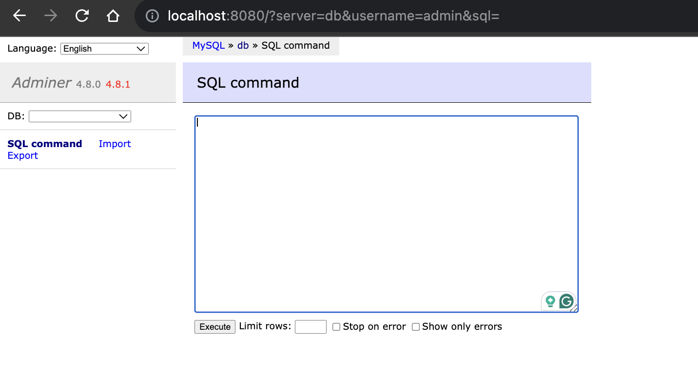
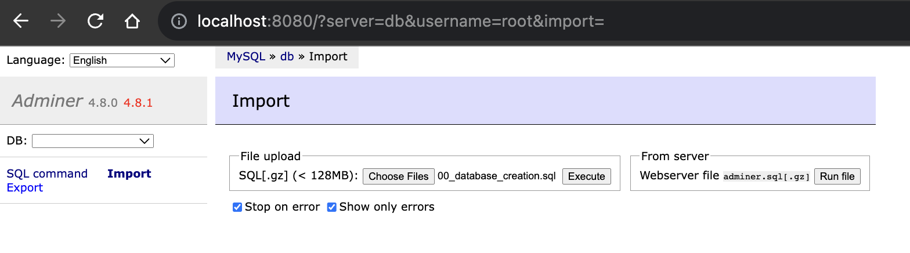
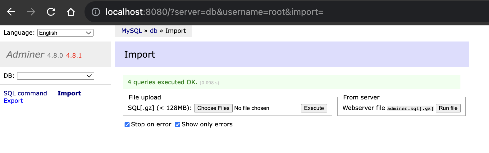
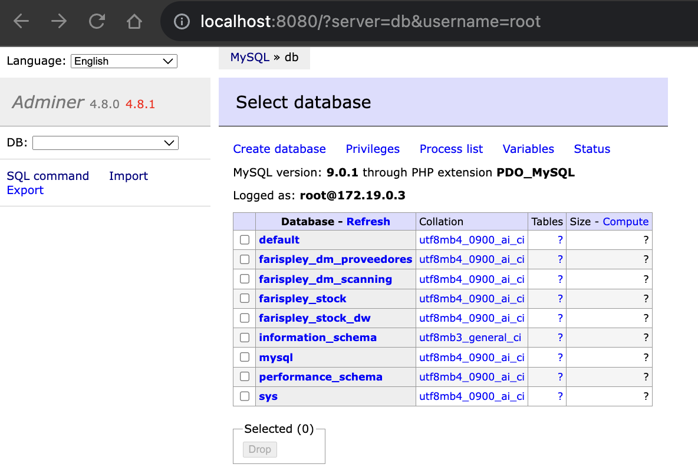

# Datawarehouse Models

Modeling a data warehouse and data marts using the Vault methodology

# Objective

Apply the Vault methodology in the modeling of a data warehouse, promoting the understanding of its fundamental components (HUBs, SATs and LINKs).

# Dependencies

In order to run this exercise, you must have docker and docker-compose installed on your computer.  
It is also recommended to use a tool like DBeaver for database management.  
If you do not have DBeaver installed, you can use "[Adminer](https://hub.docker.com/_/adminer/)" which runs alongside the MySQL database.

For more information about:

*   [MySQL on Docker](https://hub.docker.com/_/mysql)
*   [DBeaver](https://dbeaver.io/download/)
*   [Adminer](https://hub.docker.com/_/adminer/)

# How to start

To initialize this practice repository, you just simply need to run the docker-compose.yml file by doing:

`$ docker-compose up`

Once you start up the server, open your web browser and go to http://localhost:8080 and you will be able to see the "Adminer" homepage:

Use the user "root" and credentials stored on the .env file to login into Adminer:

# SQL Scripts and database creation

The /db\_scripts folder stores all the SQL scripts needed to create and perform basic operations in the database such as:

*   Database creation
*   Entity creation for each database
*   Insertion queries to populate the tables

By default, there are no databases created for the exercise, you've to create them using the **00\_database\_creation.sql** file.

Go to the "SQL command" tab in Adminer and import the file:

After execution:

Now, go to the homepage and you will see all the Farispley's databases created:

Well done! now you can start to play with the databases.